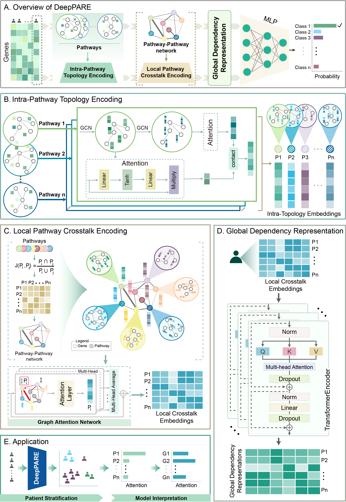

[](https://github.com/nanyuan-he/DeepPARE)
[](https://www.repostatus.org/#active)
[](https://makeapullrequest.com)
[](https://github.com/nanyuan-he/DeepPARE/commits/main)
[](https://github.com/nanyuan-he/DeepPARE)

# DeepPARE: Interpretable Multi-Scale Pathway Representation Learning for Cancer Patient Stratification and Biomarker Discovery
## 1.Introduction
This repository contains source code and data for **DeepPARE**. <br>
**DeepPARE** is an interpretable multi-scale pathway representation learning framework for cancer patient stratification and biomarker discovery. It integrates biological pathway knowledge with deep learning to learn biologically informed representations from transcriptomic profiles. DeepPARE first employs graph neural networks to encode **intra-pathway topology**, capturing structural relationships among genes within individual pathways. A pathway  graph attention module then learns **local pathway crosstalk**, followed by a transformer-based module that captures **global pathway dependencies**. The learned multi-scale pathway representations enable accurate cancer patient stratification while providing biological interpretability.<br> 
Comprehensive benchmarking across diverse cancer-related tasks, including pan-cancer tissue-of-origin prediction, renal cancer subtype classification, and colorectal cancer subtype classification, demonstrates that **DeepPARE** consistently outperforms state-of-the-art methods. Interpretability analyses identify biologically relevant pathways and genes underlying model predictions, providing mechanistic insights into cancer heterogeneity and advancing precision oncology.<br>
## 2.Design of DeepPARE
<p align="center">
  
</p>
Overview of the DeepPARE framework.

## 3.Overview
The repository is organised as follows:<br>
- `Code/KGML` contains code for retrieving pathway KGML files from the KEGG database;
- `Data/Pathway data` contains adjacency matrices of **individual pathways**, the **pathway-pathway interaction** adjacency matrix, and KGML files for all pathways;
- `Data/example_data` provides example datasets for running the DeepPARE implementation;
- The complete transcriptomic datasets used in this study are available on Zenodo: https://doi.org/10.5281/zenodo.21623260

## 4.Installation
**DeepPARE** relies on Python (version 3.12.10) environment.<br>
- Install the necessary python packages for **DeepPARE**:<br>
```sh
pip install -r numpy
```
| Package         | Version                 |
|:----------------|:------------------------|
| numpy           | 2.2.4                   |
| pandas          | 2.2.3                   |
| torch-scatter   | 2.1.2                   |
| torch-geometric | 2.7.0                   |
| torch           | 2.7.0.dev20250312+cu128 |
| lifelines       | 0.30.0                  |
| scikit-learn    | 1.6.1                   |
| tqdm            | 4.67.1                  |


## 5.Usage
The `example_data` directory provides a minimal dataset for running DeepPARE, including transcriptomic profiles and sample labels.<br>
The preprocessed pathway information required for model training, including individual pathway adjacency matrices and the pathway–pathway adjacency matrix, is provided in the `Data/pathway data` directory.

To train DeepPARE, modify the configuration parameters according to the target task and execute:

```bash
jupyter notebook Code/model_train.ipynb
